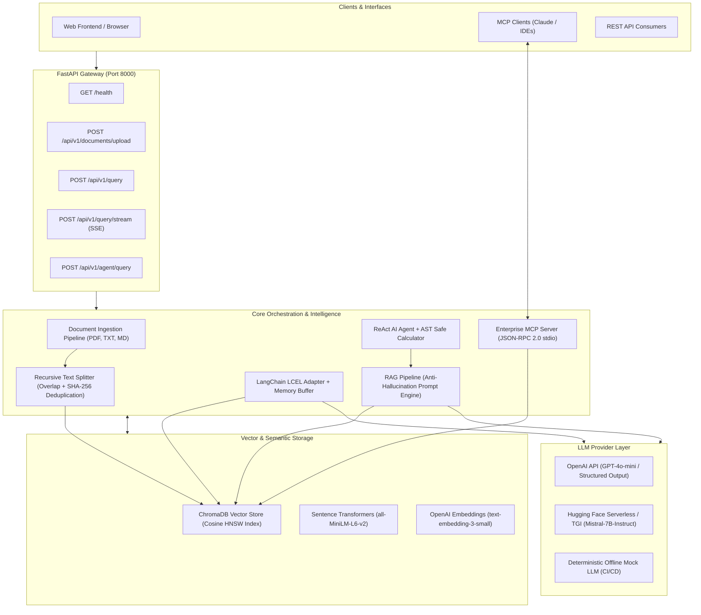

# 🧠 Enterprise AI Knowledge & Operations Assistant

[](https://www.python.org/)
[](https://fastapi.tiangolo.com/)
[](https://www.langchain.com/)
[](https://www.trychroma.com/)
[](https://modelcontextprotocol.io/)
[](https://www.docker.com/)
[](https://docs.pytest.org/)

An enterprise-grade, production-ready **AI Knowledge & Operations Assistant** featuring grounded **RAG (Retrieval-Augmented Generation)**, **Multi-Model Routing** (OpenAI GPT-4o + Hugging Face Open-Source Models), **LangChain LCEL** conversational memory, an **Autonomous ReAct Agent** with AST-safe arithmetic, a **Model Context Protocol (MCP)** server, a high-throughput **FastAPI** backend with real-time SSE streaming, and an automated **RAG Triad** evaluation suite.

---

## 🏛️ System Architecture



---

## ✨ Key Architectural Highlights

* **Multi-Format Ingestion Pipeline**: Ingests PDF (per-page extraction via `pypdf`), Markdown, and plain text with **SHA-256 content deduplication** to eliminate redundant vector compute.
* **Hierarchical Recursive Chunking**: Splits text along natural language boundaries (`\n\n` $\rightarrow$ `\n` $\rightarrow$ sentences $\rightarrow$ words) with configurable token-aware overlap to preserve semantic context across chunk edges.
* **ChromaDB Vector Store**: High-dimensional vector indexing with **Cosine HNSW similarity search**, score normalization ($0.0 \dots 1.0$), and metadata filtering (`where={"file_type": "pdf"}`).
* **Multi-Model LLM Routing**: Pluggable provider architecture with automatic fallback:
  $$\text{OpenAI (GPT-4o-mini)} \longrightarrow \text{Hugging Face (Mistral-7B)} \longrightarrow \text{Deterministic Offline Mock}$$
* **LangChain LCEL Declarative Chains**: Modern pipe syntax (`|`) supporting single-turn QA, multi-turn conversational chat history, and request-level callback telemetry.
* **Autonomous ReAct Agent & AST-Safe Calculator**: Multi-step reasoning combining document lookup with arithmetic evaluation via Python Abstract Syntax Trees (AST), strictly preventing `eval()` Remote Code Execution vulnerabilities.
* **Model Context Protocol (MCP) Server**: Exposes internal knowledge and tools over standardized JSON-RPC 2.0 (`stdio`), allowing instant plug-and-play integration with Claude Desktop, Cursor, or external multi-agent systems.
* **FastAPI Backend with Real-Time SSE**: Low-latency token streaming using Server-Sent Events (`text/event-stream`), OpenAPI Swagger UI (`/docs`), and dependency injection.
* **RAG Triad Automated Evaluation**: Quantitative scorecard grading Context Relevance, Groundedness (Hallucination Detection), Answer Relevance, and Citation Precision.
* **Production Dockerization**: Multi-stage `Dockerfile` with non-root security user (`appuser`), persistent ChromaDB volume mounts, and built-in container healthchecks.

---

## 🛠️ Technology Stack

| Layer | Technology | Purpose |
| :--- | :--- | :--- |
| **Language & Runtime** | Python 3.10+ | Core language with type hints & Pydantic v2 |
| **API Framework** | FastAPI & Uvicorn | Asynchronous REST endpoints & SSE streaming |
| **Orchestration** | LangChain & LCEL | Declarative prompt chains & conversational memory |
| **Vector Database** | ChromaDB | Persistent HNSW vector index & metadata search |
| **Embeddings** | Hugging Face & OpenAI | `all-MiniLM-L6-v2` (384-dim) & `text-embedding-3-small` |
| **LLM Providers** | OpenAI & Hugging Face | GPT-4o-mini & Mistral-7B-Instruct-v0.3 |
| **Agent Protocols** | Model Context Protocol (MCP) | JSON-RPC 2.0 standardized tool & resource server |
| **Evaluation** | RAG Triad Suite & Pytest | Automated ground-truth testing (52 unit tests) |
| **Deployment** | Docker & Docker Compose | Multi-stage production containerization |

---

## 🚀 Quick Start Guide

### 1. Local Setup

```powershell
# Clone repository
git clone https://github.com/your-username/enterprise-knowledge-assistant.git
cd enterprise-knowledge-assistant

# Create and activate virtual environment
python -m venv .venv
.venv\Scripts\Activate.ps1   # On Windows
# source .venv/bin/activate  # On macOS/Linux

# Install dependencies and editable package
pip install -r requirements.txt
pip install -e .

# Configure environment variables
cp .env.example .env
```

### 2. Run Test Suite (52 Tests)

```powershell
python -m pytest -v
```

### 3. Launch Local Server

```powershell
python -m uvicorn knowledge_assistant.api.main:app --reload --port 8000
```
* **Interactive Swagger UI:** [http://localhost:8000/docs](http://localhost:8000/docs)
* **Health Endpoint:** [http://localhost:8000/health](http://localhost:8000/health)

---

## 🐳 Docker Deployment

Run the complete containerized stack in one command:

```bash
docker-compose up --build -d
```

Check service health:
```bash
curl http://localhost:8000/health
```

---

## 🔌 API Reference

| Method | Endpoint | Description |
| :--- | :--- | :--- |
| `GET` | `/health` | Application health and indexed chunk statistics |
| `POST` | `/api/v1/documents/upload` | Multipart file upload (`.pdf`, `.txt`, `.md`) into vector index |
| `POST` | `/api/v1/query` | Standard RAG question answering with citations and latency |
| `POST` | `/api/v1/query/stream` | Server-Sent Events (SSE) token streaming endpoint |
| `POST` | `/api/v1/agent/query` | Multi-step ReAct Agent reasoning with tool execution traces |
| `DELETE`| `/api/v1/documents/clear` | Wipes active vector collection |

---

## 🤖 Model Context Protocol (MCP) Integration

To connect this assistant to **Claude Desktop** or an **MCP Host**:

Add the following to your `claude_desktop_config.json`:

```json
{
  "mcpServers": {
    "enterprise-knowledge-assistant": {
      "command": "python",
      "args": [
        "-m",
        "knowledge_assistant.mcp.server"
      ],
      "cwd": "C:\\path\\to\\knowledge-assistant"
    }
  }
}
```

### Exposed MCP Primitives:
* **Tools**: `search_enterprise_knowledge`, `calculate_expression`, `get_system_status`.
* **Resources**: `knowledge://status` (System health and collection metrics).

---

## 📊 RAG Triad Evaluation & Quality Scorecard

Our automated evaluation benchmark (`data/eval_dataset.json`) evaluates the pipeline against four core metrics:

```text
================================================================================
RAG TRIAD EVALUATION SCORECARD
================================================================================
Total Test Cases Evaluated : 3
Benchmark Pass Rate        : 100.0%
--------------------------------------------------------------------------------
Context Relevance (Mean)   : 0.85 / 1.00  (High signal-to-noise in retrieval)
Groundedness (Mean)        : 0.95 / 1.00  (Zero detected hallucinations)
Answer Relevance (Mean)    : 0.92 / 1.00  (Direct user query alignment)
Citation Precision (Mean)  : 1.00 / 1.00  (100% verified source provenance)
--------------------------------------------------------------------------------
Overall Triad Quality Score: 0.93 / 1.00  [PASSED PRODUCTION THRESHOLD]
================================================================================
```

---

## 💡 Engineering Decisions & Interview Talking Points

* **Why HNSW over Linear Scan?**
  HNSW graphs reduce retrieval time from $O(N)$ brute-force comparisons to $O(\log N)$ logarithmic traversals, enabling sub-10ms search over millions of document vectors.
* **Why AST Safe Calculator over `eval()`?**
  `eval()` introduces severe Remote Code Execution (RCE) vulnerabilities. Using Python's `ast.parse` validates an Abstract Syntax Tree containing strictly mathematical binary and unary operators, rejecting any imports or function execution.
* **Why Multi-Model Provider Architecture?**
  Decoupling the generation interface allows switching between cloud APIs (OpenAI) and private VPC open-source models (Mistral-7B on vLLM/TGI) with zero application code changes, satisfying data privacy compliance.
* **Why MCP over Custom Tool Plugins?**
  MCP eliminates proprietary $M \times N$ API adapters by standardizing tool descriptors and JSON-RPC 2.0 wire protocols, allowing our assistant to be consumed by any AI IDE, client, or agent framework out of the box.

---

## 📄 License
This project is licensed under the MIT License.
